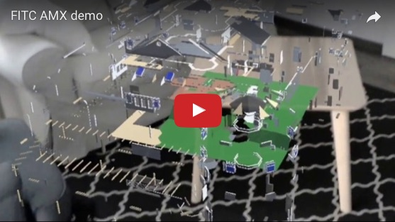

## HoloForge
youtube:

### Setup
> Install the following:
> 
* Windows 10 (not home edition)
* [VS 2015/17](https://developer.microsoft.com/en-us/windows/downloads)
* [Windows UWP SDK](https://developer.microsoft.com/en-us/windows/downloads/windows-10-sdk)
* [Unity 5.6+](https://store.unity.com/download?ref=personal)

> and follow these instructions - [Setup Hololens with Unity](https://blogs.msdn.microsoft.com/uk_faculty_connection/2017/06/11/an-introduction-to-mixed-reality-game-development-with-hololens-and-unity/)

### References

> 
* [github - KeanW/Dancing-Robot](https://github.com/KeanW/Dancing-Robot)
* [Forge for Hololens](https://autodesk-forge.github.io/?ARVR)
* [Slides](https://www.slideshare.net/Autodesk/holoworld-introduction-to-building-for-hololens)